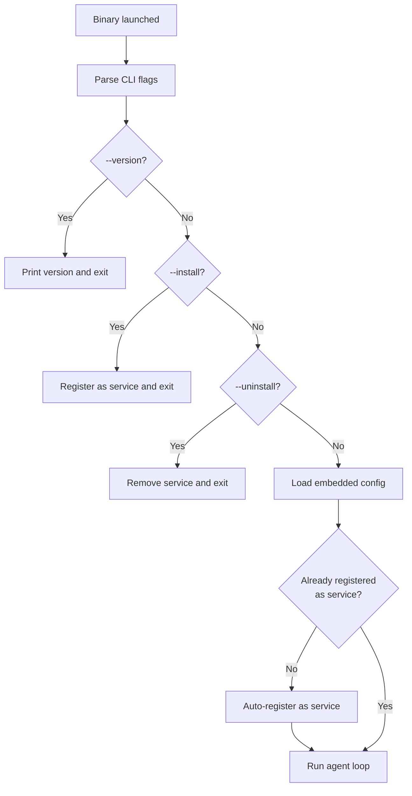

# Agent Documentation

The Vitalis agent is a lightweight Go binary that collects system metrics and sends them to the web API. It runs as a background service (Windows service, systemd unit, or launchd daemon) with offline buffering and automatic retry logic. Configuration is **embedded at build time**, making each binary fully self-contained.

---

## Table of Contents

1. [Overview](#1-overview)
2. [Configuration](#2-configuration)
3. [Collectors](#3-collectors)
4. [Offline Mode & Buffering](#4-offline-mode--buffering)
5. [Service Registration & Autostart](#5-service-registration--autostart)
6. [Building](#6-building)
7. [Extending — Adding a New Collector](#7-extending--adding-a-new-collector)

---

## 1. Overview

### What the Agent Does

The agent runs a continuous loop:

1. **Collect** — Registered collectors gather system metrics at configurable intervals
2. **Buffer** — Metrics are written to a local SQLite-backed file buffer
3. **Batch** — The scheduler groups metrics into batches at the configured batch interval
4. **Send** — Batches are gzip-compressed and POSTed to [`/api/ingest`](web/src/app/api/ingest/route.ts) with the machine token
5. **Retry** — On failure, exponential backoff with local buffering ensures no data loss

### Architecture


### Resource Budget

| Resource | Budget      | Strategy                                            |
| -------- | ----------- | --------------------------------------------------- |
| RAM      | < 50 MB     | Bounded buffer, no large caches, streaming JSON     |
| CPU      | < 2% avg    | Collection is I/O-bound, goroutines yield naturally |
| Disk     | < 50 MB     | SQLite buffer with auto-cleanup of synced records   |
| Network  | < 10 KB/min | Gzip compression, batching, delta computation       |

### Entry Point

The agent entry point is [`agent/cmd/agent/main.go`](agent/cmd/agent/main.go). It supports the following CLI flags:

```bash
./vitalis-agent [flags]

Flags:
  --version     Show version and exit
  --install     Install as system service and exit
  --uninstall   Remove system service and exit
```

> **Note:** There is no `--config` flag. Configuration is embedded into the binary at build time. See [Configuration](#2-configuration) for details.

---

## 2. Configuration

### Embedded Configuration

Configuration is **baked into the binary at build time** using Go's `//go:embed` directive. The build scripts ([`build.sh`](build.sh) / [`build.ps1`](build.ps1)) copy the selected config from [`agent/configs/`](agent/configs/) into a staging file ([`agent/cmd/agent/embed_config.yaml`](agent/cmd/agent/embed_config.yaml)), which is then embedded by [`agent/cmd/agent/embed.go`](agent/cmd/agent/embed.go).

This means:

- **No external config file is needed** — the binary is fully self-contained
- **Each binary is machine-specific** — built with the correct server URL and machine token
- **Environment variables still override** embedded values at runtime

### Config Precedence

```
Embedded YAML (baked at build time)
        ↓ overridden by
Environment Variables (SA_SERVER_URL, SA_MACHINE_TOKEN, SA_LOG_LEVEL)
```

Configuration loading is implemented in [`agent/internal/config/config.go`](agent/internal/config/config.go).

### The `configs/` Directory

The [`agent/configs/`](agent/configs/) directory contains YAML configuration files — one per target machine or environment. Examples:

| File                                                 | Purpose                              |
| ---------------------------------------------------- | ------------------------------------ |
| [`agent.yaml`](agent/configs/agent.yaml)             | Default / template configuration     |
| [`agent_z370m.yaml`](agent/configs/agent_z370m.yaml) | Configuration for a specific machine |

To add a new configuration:

1. Copy an existing config file in `agent/configs/` (e.g., `cp agent.yaml agent_myserver.yaml`)
2. Edit the new file with the target machine's server URL and machine token
3. Build with `./build.sh --config agent_myserver`

The build scripts offer an **interactive picker** when `--config` is not specified — they list all YAML files in `agent/configs/` and prompt you to choose one.

### Full Configuration Reference

```yaml
# Server connection settings
server:
  # URL of the Vitalis web app (must use HTTPS for non-localhost)
  url: "https://your-app.vercel.app"

  # Machine authentication token (generated in the dashboard)
  # Prefer using SA_MACHINE_TOKEN env var in production
  machine_token: "mtoken_your-token-here"

# Metric collection settings
collection:
  # How often to collect metrics from all collectors
  # Accepts Go duration strings: "10s", "15s", "30s", "1m"
  interval: "15s"

  # How often to batch and send collected metrics to the API
  # Should be >= interval (typically 2x the interval)
  batch_interval: "30s"

  # Maximum number of processes to include in each snapshot
  # Processes are sorted by CPU + RAM usage, top N are kept
  top_processes: 10

# Local buffer settings (offline resilience)
buffer:
  # Maximum buffer size in megabytes
  # When exceeded, oldest synced records are purged
  max_size_mb: 50

  # Path to the buffer directory (SQLite database files)
  # Use absolute paths for service installations
  db_path: "./buffer"

# Logging settings
logging:
  # Log level: "debug", "info", "warn", "error"
  level: "info"

  # Path to the log file (JSON format)
  # Console output is always enabled (human-readable format)
  # Set to empty string to disable file logging
  file: "./agent.log"
```

### Default Values

Defined in [`DefaultConfig()`](agent/internal/config/config.go:75):

| Setting                     | Default                 | Description                |
| --------------------------- | ----------------------- | -------------------------- |
| `server.url`                | `http://localhost:3000` | API server URL             |
| `server.machine_token`      | _(empty)_               | Must be configured         |
| `collection.interval`       | `15s`                   | Collection frequency       |
| `collection.batch_interval` | `30s`                   | Batch send frequency       |
| `collection.top_processes`  | `10`                    | Max processes per snapshot |
| `buffer.max_size_mb`        | `50`                    | Max buffer disk usage      |
| `buffer.db_path`            | `./buffer.db`           | Buffer file location       |
| `logging.level`             | `info`                  | Log verbosity              |
| `logging.file`              | `./agent.log`           | Log file path              |

### Environment Variable Overrides

These environment variables take the highest precedence and override embedded config values:

| Variable           | Overrides              | Example                                       |
| ------------------ | ---------------------- | --------------------------------------------- |
| `SA_SERVER_URL`    | `server.url`           | `https://your-app.vercel.app`                 |
| `SA_MACHINE_TOKEN` | `server.machine_token` | `mtoken_a1b2c3d4-e5f6-7890-abcd-ef1234567890` |
| `SA_LOG_LEVEL`     | `logging.level`        | `debug`                                       |

> **Security Recommendation:** Use `SA_MACHINE_TOKEN` environment variable instead of storing the token in the YAML file. This prevents accidental exposure through file permissions or version control.

### Validation

The [`Validate()`](agent/internal/config/config.go:134) method enforces:

- `server.url` is not empty
- `server.machine_token` is not empty
- `server.url` uses HTTPS for non-localhost URLs (exits with error if HTTP is used in production)

---

## 3. Collectors

All collectors implement the [`Collector`](agent/internal/collector/collector.go:9) interface:

```go
type Collector interface {
    Name() string
    Collect(ctx context.Context) (interface{}, error)
    IsAvailable() bool
}
```

Collectors are registered in [`runAgent()`](agent/cmd/agent/main.go:148) at startup:

```go
registry.Register(collector.NewCPUCollector())
registry.Register(collector.NewMemoryCollector())
registry.Register(collector.NewDiskCollector())
registry.Register(collector.NewNetworkCollector())
registry.Register(collector.NewProcessCollector(cfg.Collection.TopProcesses))
registry.Register(collector.NewUptimeCollector())
registry.Register(collector.NewTemperatureCollector())
registry.Register(collector.NewShutdownCollector())
```

### Collector Reference

| Collector       | Source File                                                 | Data Collected                     | Notes                                      |
| --------------- | ----------------------------------------------------------- | ---------------------------------- | ------------------------------------------ |
| **CPU**         | [`cpu.go`](agent/internal/collector/cpu.go)                 | Overall %, per-core %              | Uses gopsutil; 1-second sample window      |
| **Memory**      | [`memory.go`](agent/internal/collector/memory.go)           | Used bytes, total bytes            | Virtual memory via gopsutil                |
| **Disk**        | [`disk.go`](agent/internal/collector/disk.go)               | Per-mount: total, used, free bytes | Filters to physical disks only             |
| **Network**     | [`network.go`](agent/internal/collector/network.go)         | RX bytes, TX bytes (delta)         | Computes delta between consecutive reads   |
| **Process**     | [`process.go`](agent/internal/collector/process.go)         | Top N processes by CPU + RAM       | Sorted, truncated to `top_processes` count |
| **Temperature** | [`temperature.go`](agent/internal/collector/temperature.go) | CPU temp, GPU temp (°C)            | Platform-dependent; may require drivers    |
| **Uptime**      | [`uptime.go`](agent/internal/collector/uptime.go)           | Seconds since boot                 | Single integer value                       |
| **Shutdown**    | [`shutdown.go`](agent/internal/collector/shutdown.go)       | Graceful shutdown signal           | Flushes buffer on SIGTERM/SIGINT           |

### Platform Abstraction

Collectors use the platform abstraction layer defined in [`agent/internal/platform/`](agent/internal/platform/):

| File                                                 | Platform | Description                             |
| ---------------------------------------------------- | -------- | --------------------------------------- |
| [`platform.go`](agent/internal/platform/platform.go) | All      | Interface definition                    |
| [`windows.go`](agent/internal/platform/windows.go)   | Windows  | WMI and Win32 API implementations       |
| [`stub.go`](agent/internal/platform/stub.go)         | Other    | Stub implementations for unsupported OS |

The platform layer uses Go build tags to compile platform-specific code only for the target OS.

---

## 4. Offline Mode & Buffering

The agent is designed to operate reliably even when the API server is unreachable. All metrics pass through a local buffer before transmission.

### How It Works


### Buffer Implementation

The buffer is implemented in [`agent/internal/buffer/buffer.go`](agent/internal/buffer/buffer.go) using a file-based storage system:

- **Storage:** File-based buffer in the configured `db_path` directory
- **Persistence:** Survives agent crashes, reboots, and OS updates
- **Capacity:** Configurable via `buffer.max_size_mb` (default: 50 MB)
- **Cleanup:** Synced records are automatically purged
- **Permissions:** Directory created with `0750`, files with `0640`

### Capacity Estimates

At the default 15-second collection interval:

| Duration Offline | Metrics Buffered | Approximate Size |
| ---------------- | ---------------- | ---------------- |
| 1 hour           | 240              | ~240 KB          |
| 6 hours          | 1,440            | ~1.4 MB          |
| 24 hours         | 5,760            | ~5.8 MB          |
| 7 days           | 40,320           | ~40 MB           |

The default 50 MB buffer can hold approximately **8–9 days** of metrics at 15-second intervals.

### Startup Flush

On startup, the agent calls [`FlushBuffer()`](agent/internal/sender/sender.go:167) to drain any metrics that were buffered during a previous outage. This ensures catch-up sync happens automatically after restarts.

### Retry Strategy

The sender (implemented in [`agent/internal/sender/sender.go`](agent/internal/sender/sender.go)) uses exponential backoff:

| Attempt | Delay | Behavior                                   |
| ------- | ----- | ------------------------------------------ |
| 1       | 0s    | Immediate first attempt                    |
| 2       | 2s    | First retry                                |
| 3       | 4s    | Second retry                               |
| 4       | 8s    | Third and final retry                      |
| —       | —     | Buffer locally after all retries exhausted |

Special cases:

- **HTTP 429 (Rate Limited):** Buffer immediately without further retries
- **HTTP 4xx (Client Error):** Log error, discard batch (bad data)
- **HTTP 5xx / Timeout:** Retry with backoff, then buffer
- **Network Error:** Retry with backoff, then buffer

---

## 5. Service Registration & Autostart

The agent automatically registers itself as a system service on first run. This eliminates the need for manual service installation steps.

### How It Works

On every startup, the agent checks whether it is already registered as a system service. If not, it automatically installs itself using the platform-appropriate mechanism. Failures are logged as warnings but do not prevent the agent from running.



### Platform-Specific Mechanisms

The autostart package ([`agent/internal/autostart/`](agent/internal/autostart/autostart.go)) provides a platform-agnostic [`Manager`](agent/internal/autostart/autostart.go:6) interface with platform-specific implementations:

| Platform | Mechanism             | Implementation                                                          | Service Name        | Requires      |
| -------- | --------------------- | ----------------------------------------------------------------------- | ------------------- | ------------- |
| Windows  | Windows Service (SCM) | [`autostart_windows.go`](agent/internal/autostart/autostart_windows.go) | `VitalisAgent`      | Administrator |
| Linux    | systemd unit file     | [`autostart_linux.go`](agent/internal/autostart/autostart_linux.go)     | `vitalis-agent`     | root          |
| macOS    | launchd plist         | [`autostart_darwin.go`](agent/internal/autostart/autostart_darwin.go)   | `com.vitalis.agent` | root          |

### Manual Control with `--install` / `--uninstall`

While the agent auto-installs on first run, you can also manage service registration manually:

```bash
# Manually install as a system service
./vitalis-agent --install

# Manually remove the system service
./vitalis-agent --uninstall
```

These flags register or remove the service and then exit immediately. They are useful for:

- **Automation scripts** that need explicit control over service lifecycle
- **Uninstalling** the agent cleanly from a machine
- **Re-installing** after moving the binary to a different path

### Service Management

After the agent is registered as a service, use the platform's native tools to manage it:

#### Windows

```powershell
sc query VitalisAgent          # Check status
sc stop VitalisAgent           # Stop the service
sc start VitalisAgent          # Start the service
sc stop VitalisAgent && sc start VitalisAgent  # Restart
```

#### Linux

```bash
sudo systemctl status vitalis-agent    # Check status
sudo systemctl stop vitalis-agent      # Stop
sudo systemctl start vitalis-agent     # Start
sudo systemctl restart vitalis-agent   # Restart
sudo journalctl -u vitalis-agent -f    # View logs
```

#### macOS

```bash
launchctl list | grep vitalis          # Check status
sudo launchctl stop com.vitalis.agent  # Stop
sudo launchctl start com.vitalis.agent # Start
```

### Logs

- **Windows:** Event Viewer → Windows Logs → Application → filter by source `VitalisAgent`, plus the log file configured in `logging.file`
- **Linux:** `journalctl -u vitalis-agent` plus the log file
- **macOS:** `/var/log/vitalis/stdout.log` and `/var/log/vitalis/stderr.log` plus the log file

### Graceful Shutdown

When the service receives a stop signal:

1. Stop all collector tickers
2. Flush pending events to buffer
3. Attempt one final send (10-second timeout)
4. Close buffer cleanly
5. Exit with code 0

---

## 6. Building

### Prerequisites

- **Go 1.21+** — [go.dev/dl](https://go.dev/dl/)
- **Git** — to clone the repository

### Using Build Scripts (Recommended)

The project includes cross-platform build scripts ([`build.sh`](build.sh) for macOS/Linux and [`build.ps1`](build.ps1) for Windows) that handle **config embedding**, compilation, version embedding, and output organization.

#### Config Selection

The build scripts require a configuration to embed. You can specify it with `--config` or use the interactive picker:

```bash
# Specify a config by name (from agent/configs/)
./build.sh --config agent_z370m

# Interactive: lists available configs and prompts you to choose
./build.sh
```

```
Available configurations:
  1) agent
  2) agent_z370m

Select configuration [1-2]: _
```

#### Build for Current Platform

```bash
./build.sh --config agent_z370m
```

#### Build All Platforms

```bash
./build.sh --all --config agent_z370m --version 1.0.0
```

#### Cross-Compile for a Specific Platform

```bash
./build.sh --platform windows/amd64 --config agent_z370m
```

#### Windows Users (PowerShell)

```powershell
.\build.ps1 -Config "agent_z370m" -All -Version "1.0.0"
```

Binaries are output to the `build/` directory with platform-specific naming (e.g., `vitalis-agent-windows-amd64.exe`, `vitalis-agent-linux-amd64`).

#### Clean Build Artifacts

```bash
./build.sh --clean
```

### Manual Build

If you prefer manual builds, you must first stage the config file before running `go build`:

```bash
cd agent

# Stage the config for embedding
cp configs/agent_z370m.yaml cmd/agent/embed_config.yaml

# Build
go build -ldflags "-s -w -X main.version=1.0.0" -o vitalis-agent ./cmd/agent/

# Clean up the staging file
rm cmd/agent/embed_config.yaml
```

### Manual Cross-Compilation

#### Windows (amd64)

```bash
cp configs/agent_z370m.yaml cmd/agent/embed_config.yaml
GOOS=windows GOARCH=amd64 go build -o vitalis-agent.exe ./cmd/agent/
rm cmd/agent/embed_config.yaml
```

#### Linux (amd64)

```bash
cp configs/agent_z370m.yaml cmd/agent/embed_config.yaml
GOOS=linux GOARCH=amd64 go build -o vitalis-agent ./cmd/agent/
rm cmd/agent/embed_config.yaml
```

#### macOS (Apple Silicon — arm64)

```bash
cp configs/agent_z370m.yaml cmd/agent/embed_config.yaml
GOOS=darwin GOARCH=arm64 go build -o vitalis-agent ./cmd/agent/
rm cmd/agent/embed_config.yaml
```

#### macOS (Intel — amd64)

```bash
cp configs/agent_z370m.yaml cmd/agent/embed_config.yaml
GOOS=darwin GOARCH=amd64 go build -o vitalis-agent ./cmd/agent/
rm cmd/agent/embed_config.yaml
```

### Versioned Build

Embed a version string using `-ldflags`:

```bash
go build -ldflags "-X main.version=1.0.0" -o vitalis-agent ./cmd/agent/
```

Verify:

```bash
./vitalis-agent --version
# Output: vitalis-agent 1.0.0
```

### Dependencies

All dependencies are defined in [`agent/go.mod`](agent/go.mod):

| Module                          | Version | Purpose                       |
| ------------------------------- | ------- | ----------------------------- |
| `github.com/shirou/gopsutil/v3` | v3.24.1 | Cross-platform system metrics |
| `go.uber.org/zap`               | v1.27.0 | Structured logging            |
| `golang.org/x/sys`              | v0.17.0 | Windows service support       |
| `gopkg.in/yaml.v3`              | v3.0.1  | YAML configuration parsing    |

---

## 7. Extending — Adding a New Collector

The collector system is designed for easy extension. Adding a new collector requires **one new file** with no changes to existing code.

### Step 1: Create the Collector File

Create a new file in [`agent/internal/collector/`](agent/internal/collector/), e.g., `gpu.go`:

```go
package collector

import "context"

// GPUCollector collects GPU utilization metrics.
type GPUCollector struct{}

// NewGPUCollector creates a new GPU collector.
func NewGPUCollector() *GPUCollector {
    return &GPUCollector{}
}

// Name returns the unique identifier for this collector.
func (c *GPUCollector) Name() string {
    return "gpu"
}

// Collect gathers GPU utilization data.
func (c *GPUCollector) Collect(ctx context.Context) (interface{}, error) {
    // Implement GPU metric collection here
    // Return your data structure
    return map[string]interface{}{
        "utilization": 45.0,
        "memory_used": 2147483648,
        "memory_total": 8589934592,
    }, nil
}

// IsAvailable checks if GPU monitoring is supported on this platform.
func (c *GPUCollector) IsAvailable() bool {
    // Check if GPU monitoring tools/drivers are available
    return true
}
```

### Step 2: Register the Collector

Add the collector to the registry in [`agent/cmd/agent/main.go`](agent/cmd/agent/main.go:170):

```go
registry.Register(collector.NewGPUCollector())
```

### Step 3: Update the Metric Model

If the new collector produces data that needs to be sent to the API, update the [`MetricSnapshot`](agent/internal/models/metrics.go) struct in [`agent/internal/models/metrics.go`](agent/internal/models/metrics.go) to include the new fields.

### Step 4: Update the API Schema

Add corresponding fields to the Zod validation schema in [`web/src/lib/validation/metrics.ts`](web/src/lib/validation/metrics.ts) and the database schema in [`web/src/lib/db/schema.ts`](web/src/lib/db/schema.ts).

### Design Principles

- **Single Responsibility:** Each collector gathers one type of metric
- **Platform Awareness:** Use [`IsAvailable()`](agent/internal/collector/collector.go:18) to gracefully skip unsupported platforms
- **Context Respect:** Honor the `ctx` parameter for cancellation during shutdown
- **Error Tolerance:** Return errors rather than panicking — the scheduler logs and continues
- **Minimal Footprint:** Collectors should complete quickly (< 1 second) and use minimal memory
